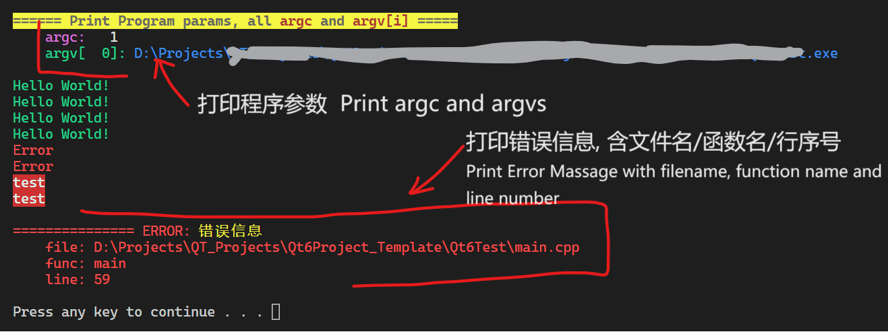

# ConsoleUtil

A **HEADER FILE** project with macros that can change text color/style and move cursor in CONSOLE by ANSI Escape Codes, and some utility macros for CUDA and Qt.


**Homepage**:  https://github.com/BH2WFR/ConsoleUtil

**author**: 	BH2WFR

**LICENSE**: 	**MIT** License

Reference of Ansi Escape Codes:

- https://en.wikipedia.org/wiki/ANSI_escape_code

- https://zh.wikipedia.org/wiki/ANSI%E8%BD%AC%E4%B9%89%E5%BA%8F%E5%88%97


----------

### WARNING:

- features using Ansi Escape code (like color customizing, or cursor moving macros in this header file) **DO NOT SUPPORT Windows version lower than Windows 10 1511**, otherwise it can't display properly in windows cmd.
    - If you are using these operating systems, pls `#define CONSOLE_UTIL_ANSI_ESCAPE_UNSUPPORTED  1` before `#include <ConsoleUtil/ConsoleUtil.h>` to disable features by printing Ansi Escape Code.

- C language version `≥ C99`, C++ language `≥ C++98`, with `##__VA_ARGS__` extension support. 

    (**MSVC supports `##__VA_ARGS__` since VS2015 Update 3**. if your MSVC or VS version is older, pls delete "`##`", MSVC eats trailing comma before `__VA_ARGS__` by default without `/Zc::preprocessor` command)

- Pls #include the header file <`ConsoleUtil/ConsoleUtil.h`> after other header files, especially those from libraries such as Qt/fmtlib. DO NOT #include <`ConsoleUtil/ConsoleUtil.h`> in header files.

- You can include <`ConsoleUtil/CppUtil.h`> in header files.  No need to include <`ConsoleUtil/CppUtil.h`> in source files if you already included <`ConsoleUtil/ConsoleUtil.h`>, because it has been included in <`ConsoleUtil/ConsoleUtil.h`>.


---

### Major Features:
```c++
#include <ConsoleUtil/ConsoleUtil.h> // already wrapped in <ConsoleUtil/ConsoleUtil.h>
```

1. **Set Front Color, Back Color, and font style** for messages to print by printf/cout.

   Forecolors: `FBlack`, `FRed`, `FGreen`, `FYellow`, `FBlue`, `FMagenta`, `FCyan`, `FWhite`, `FDefault`, `FRgb(66, 66, 66)`

   Bright Forecolors: `FGray(=FGrey,FLBlack)`, `FLRed`, `FLGreen`, `FLYellow`, `FLBlue`, `FLMagenta`, `FLCyan`, `FLWhite`;

   Backcolors: `BBlack`, `BRed`, `BGreen`, `BYellow`, `BBlue`, `BMagenta`, `BCyan`, `BWhite`, `BDefault`, `BRgb(66, 66, 66)`;

   Bright Backcolors: `BGray(=BGrey,BLBlack)`, `BLRed`, `BLGreen`, `BLYellow`, `BLBlue`, `BLMagenta`, `BLCyan`, `BLWhite`;

   Font Styles: `CBold`, `CWeak`, `CItalic`, `CUnderLine`, `CFlash`, `CQFlash`, `CInvert`(swap fg and bg colors), `CHide`;

   Reset to Default: `CRst` or `CReset`, you must append this to the end of the string literal to revert console style back to default.

   ```c++
   printf(BRed FLGreen CQFlash "test" CReset "\n");
   	// Red Background, Light Green Text Forecolor, and flashing quickly
   std::cout << CCyan "test" CReset << "\n"; // Text forecolor: cyan
   fmt::println(CYellow "test" CReset);      // Text forecolor: yellow
   ```

   

   

2. **Control text cursor location** in console, or erase text.

    Move cursor: `CUp(2)`, `CDown(3)`, `CFwd(4)`, `CBack(5)`, `CNextLn(1)`, `CPrevLn(1)`,

    ​	`CHorzPos(12)`(column X, absolute), `CPos(44, 55)`(move the cursor to row 44, column 55)

    Just print them, use individual or append to string literals.

    ```c++
    printf(CForward(2)); // move thr cursor 2 characters right
    printf(CCursorPos(15, 20)); // move the text cursor to (15, 20) position
    CUTIL_CONSOLE_CURSOR_POS(15, 20); // equivalent, calls SetConsoleCursorPosition() in win32.
    ```

    

3. **set console encoding**, console **window size** (in windows), or **console title**, also with pause program and force abort the program.

    ```c++
    CUTIL_CHCP_ENCODING_UTF8(); 	// switch console encoding to UTF-8 (windows)
    CUTIL_CONSOLE_TITLE("MyProject"); // set console window title (calls SetConsoleTitleA() or SetConsoleTitleW() for windows, and print ansi escape code "\033]0;%s\007" for linux)
    // CUTIL_CONSOLE_TITLE(_TEXT("MyProgram"));
    // CUTIL_CONSOLE_TITLE_A("MyProgram");
    // CUTIL_CONSOLE_TITLE_W(L"MyProgram");
    
    CUTIL_CONSOLE_SIZE(100, 30);	// set console window size to with of 30 chars and height of 30 lines (only available in windows)
    CUTIL_CONSOLE_CLEAR();			// clear console (calls system("cls") )
    
    printf("中文한글\n");	// you can correctly display this when the code saved in UTF-8 Encoding, especially in MSVC Compiler.
    
    ```

    ```c++
    // available encodings:
        CUTIL_CHCP_ENCODING_UTF8();
        CUTIL_CHCP_ENCODING_GB2312();
        CUTIL_CHCP_ENCODING_BIG5();
        CUTIL_CHCP_ENCODING_KOR();
        CUTIL_CHCP_ENCODING_JIS();
        CUTIL_CHCP_ENCODING_LATIN1();
        CUTIL_CHCP_ENCODING_LATIN2();
        CUTIL_CHCP_ENCODING_CYR();
        CUTIL_CHCP_ENCODING_WIN1250();
        CUTIL_CHCP_ENCODING_WIN1251();
        CUTIL_CHCP_ENCODING_WIN1252();
    ```

4. **Print Text only in Debug Build**, and do Not Print in Release Build.

    pls make sure that macro "`_DEBUG`" is defined in Debug Build, or macro "`NDEBUG`" is defined in Release Build.

    ```c++
    int a{1};
    CUTIL_DEBUG_PRINTLN("debug text {}", a); 		// calls fmt::println()(fmtlib) or std::println()(C++23)
    CUTIL_DEBUG_COUT("debug text " << a << '\n'); 	// calls std::cout <<
    CUTIL_DEBUG_PRINTF("debug text %d", a); 		// calls printf()
    // these function-like macros will DO NOTHING IN RELEASE BUILD.
    
    CUTIL_DEBUG_PRINTLN_ERR("debug stderr text {}", a); // print to stderr
    CUTIL_DEBUG_CERR("debug stderr text " << a << '\n');
    CUTIL_DEBUG_PRINTF_ERR("debug stderr text %d", a);
    
    ```


5. Flush the input buffer to ensure that subsequent "scanf()" or "cin" calls receive valid input.

    (吸收输入缓存区内的其余字符, 以便下次 scanf 或 cin 时能够获取到正确的输入内容)

    ```c++
    // #define CUTIL_FLUSH_INPUT_BUFFER()	{char ch; while((ch = getchar()) != '\n') continue;}
    int num1, num2;
    scanf("%d", &num1); // you inputed "123ss", then still remains characters "ss" in the input buffer
    CUTIL_CONSOLE_FLUSH_INPUTBUFFER(); // flush input buffer (clear)
    scanf("%d", &num2); // you can normally input other contents.
    ```


6. **print argc and argv arguments** of main(int argc, char* argv[]) function in sequence.

    ```c++
    int main(int argc, char* argv[]){
    CUTIL_PRINT_ARGV(argc, argv);// print all argc and argv[n] of main() function
		return 0;
    }
    ```
    
    
    
    
    
7. **Print custom Error Message** with filename, line number and function name

    打印错误信息，并输出当前文件名、行号、函数名

    

    

8. **Other useful C/C++ Macros**
   
    ```c++
    #include <ConsoleUtil/CppUtil.h>
    // already wrapped in <ConsoleUtil/ConsoleUtil.h>, you can include the latter instead in source files.
    // <ConsoleUtil/CppUtil.h> can be included in header files.
    ```
    - decide if the project is under debug build or Release build mode.
    
        in MSVC, macro `_DEBUG` is defined under debug build; in GCC, macro `NDEBUG` is defined under release build.
    
        you can add `add_compile_definitions("$<IF:$<CONFIG:Debug>,_DEBUG,NDEBUG>")` in CMake.
    
        ```c++
        #include <ConsoleUtil/CppUtil.h>
        #if CUTIL_DEBUG_BUILD // Debug
            //...
        #else // Release RelWithDebInfo MinSizeRel
            //...
        #endif
        ```
    
    - set bit to a unsigned integer variable in some hardware projects; rotate bits
    
        ```c++
        #include <ConsoleUtil/CppUtil.h>
        uint16_t num {0b00000000'00000001}; // C++14
        // operate bit by index, starts at 0. use them in a seperate line, and returns nothing
        CUTIL_BIT_SET_IDX(num, 0);		// equals to {num |=  (1u << 0));}
        CUTIL_BIT_CLEAR_IDX(num, 2);	// equals to {num &= ~(1u << 2));}
        CUTIL_BIT_TOGGLE_IDX(num, 3);	// equals to {num ^=  (1u << 3));}
        
        
        if(CUTIL_BIT_GET_IDX(num, 0) != 0){ // reading bit, if bit is 1, returns (1<<BIT_IDX), NOT 1
        	printf("%x\n", num);
        }
        if(CUTIL_BIT_CHK_IDX(num, 0) == 1){ // reading bit, if bit is 1, returns 1, != CUTIL_BIT_GET_IDX()
        	printf("%x\n", num);
        }
        
        // operate bit by mask
        CUTIL_BIT_SET_MASK(num, 0x2B00); 	// equals to {num |=  0x2B00;}
        CUTIL_BIT_CLEAR_MASK(num, 0x2B00); 	// equals to {num &= ~0x2B00;}
        CUTIL_BIT_TOGGLE_MASK(num, 0x1100); // equals to {num ^=  0x1100;}
        
        if(CUTIL_BIT_GET_MASK(num, 0x0022) != 0){ // returns (num & 0x0022)
        	printf("%x\n", num);
        }
        
        // rotate bits. use them in a seperate line, and returns nothing
        uint16_t var{0x1234};
        
        CUTIL_BIT_ROTATE_LEFT_SIZE(8*sizeof(uint16_t), var, 1); // rotate bits of `var` by 1 bit step
        CUTIL_BIT_ROTATE_RIGHT_SIZE(8*sizeof(uint16_t), var, 1);
        
        CUTIL_BIT_ROTATE_LEFT_TYPE(decltype(var), var, 1); // equivelent, also `typeof` for GNU C or C23
        CUTIL_BIT_ROTATE_RIGHT_TYPE(decltype(var), var, 1);
        
        CUTIL_BIT_ROTATE_LEFT(var, 1); // equivelent, C++, GNU C, C23 only
        CUTIL_BIT_ROTATE_RIGHT(var, 1);
        
        ```
    
    - swap variables in C (types of `_VAR1` and `_VAR2` should be strictly equal; do not use in C++, pls replace with std::swap()), 
    
        or get the maximum or minimum item between two numbers;
    
        ```c
        #include <ConsoleUtil/CppUtil.h>
        uint32_t a = 1, b = 2; // type of `a` and `b` must be strictly equal.
        
        CUTIL_SWAP(a, b); // use in C++(decltype), GNU C(typeof), or C23(typeof)
        
        CUTIL_SWAP_TYPE(uint32_t, a, b); 	// equivelent, specify the type.
        CUTIL_SWAP_TYPE(typeof(a), a, b); 	// equivelent, in GNU C or C23
        CUTIL_SWAP_TYPE(decltype(a), a, b); // equivelent in C++, but prefer to use `std::swap()`
        
        int max_ab = CUTIL_MAX(a, b); // maximum number between a and b
        int min_ab = CUTIL_MIN(a, b); // minimum number between a and b
        ```
    
    - check if two floating-point numbers are equal (float, double, long double) by checking diff of two numbers is within epsilon limit.
    
        ```c++
        #include <ConsoleUtil/CppUtil.h>
        float a = -1.00000f, b = -0.99999f; // they can regarded as equal
        double c = 1.000000000, d = 1.0000000001;
        
        bool isEqual1 = CUTIL_EQUAL_F(a, b); // fabs(a-b) within (-epsilon, +epsilon), epsilon == FLT_EPSILON in <float.h>
        bool isEqual2 = CUTIL_EQUAL_D(c, d); // epsilon == DBL_EPSILON in <float.h>
        bool isEqual3 = CUTIL_EQUAL(c, d, 0.0001); // custom epsilon value
        
        ```
    
        
    
    - count amount of arguments (up to 35)
    
        ```c
        #include <ConsoleUtil/CppUtil.h>
        int a = CUTIL_VA_CNT(); 			// -> 0
        int b = CUTIL_VA_CNT(b1); 			// -> 1
        int c = CUTIL_VA_CNT(c1, c2); 		// -> 2
        int c = CUTIL_VA_CNT(c1, c2, c3); 	// -> 3
        ```
    
    - match C++ language version, especially if you want to let the project build both by MSVC and G++.
    
        `CUITIL_CPP_LANG` equals to "`_MSVC_LANG`" for MSVC, and "`__cplusplus`" for other compilers.
    
        ```c++
        #include <ConsoleUtil/CppUtil.h>
        #if CUTIL_CPP_LANG >= 199711L	// C++98
        #if CUTIL_CPP_LANG >= 201103L	// C++11
        #if CUTIL_CPP_LANG >= 201402L	// C++14
        #if CUTIL_CPP_LANG >= 201703L	// C++17
        #if CUTIL_CPP_LANG >= 202002L	// C++20
        #if CUTIL_CPP_LANG >= 202302L	// C++23 (temporary unsupported)
        ```
    
    - set C++11 class constructor/moving/copying to disabled/default
        ```c++
        #include <ConsoleUtil/CppUtil.h>
        class MyClass{
        public:
            CUTIL_CLASS_DEFAULT_CONSTRUCTOR(MyClass) // generates MyClass(), ~MyClass() = default;
            
            CUTIL_CLASS_DISABLE_COPY_MOVE(MyClass) // cannot move or copy this class
            // =delete: MyClass(const MyClass&), operator=(const MyClass&), MyClass(MyClass&&), operator=(MyClass&&),
        }
        
        class MyClass{
        public:
            CUTIL_CLASS_DEFAULT_FUNCTIONS(MyClass)
            // generates 6 functions =default: MyClass(), ~MyClass(), MyClass(const MyClass&),
            //     operator=(const MyClass&), MyClass(MyClass&&), operator=(MyClass&&)
        }
        /* available macros:
        #define CUTIL_CLASS_DEFAULT_CONSTRUCTOR(_CLASS_NAME)
        #define CUTIL_CLASS_DISABLE_COPY(_CLASS_NAME)
        #define CUTIL_CLASS_DEFAULT_COPY(_CLASS_NAME)
        #define CUTIL_CLASS_DISABLE_MOVE(_CLASS_NAME)
        #define CUTIL_CLASS_DEFAULT_MOVE(_CLASS_NAME)
        #define CUTIL_CLASS_DISABLE_COPY_MOVE(_CLASS_NAME)
        #define CUTIL_CLASS_DEFAULT_COPY_MOVE(_CLASS_NAME)
        #define CUTIL_CLASS_DEFAULT_FUNCTIONS(_CLASS_NAME)
        */
        ```
    
    - memory allocation and operations for C (wrapped `malloc()` `free()` `memset()` `memcpy()` with typename to macros. use AMOUNT of variables to substitute length in bytes.) `CUTIL_TYPE_FREE()` macro also sets pointer to `nullptr`.
    
        ```c++
        #include <ConsoleUtil/CppUtil.h>
        
        const size_t amount = 20; // amount of variables ( length in bytes! )
        uint32_t* aD1 = CUTIL_TYPE_MALLOC(uint32_t, amount);
        	// std::vector<uint32_t> v1(20); -> elements == 0xCDCDCDCD in heap
        uint32_t* aD2 = CUTIL_TYPE_CALLOC(uint32_t, amount); // std::vector<uint32_t> v1(20, 0x00000000);
        uint32_t aD3[amount]; // C99 VLA, unsupported in C++, -> elements == 0xCCCCCCCC in stack
        
        uint32_t* aD3 = CUTIL_TYPE_MEMSET(uint32_t, aD1, 0x66, amount);
        	// set all elements of aD1 to 0x66666666, returns aD3 == aD1
        uint32_t* aD4 = CUTIL_TYPE_MEMMOVE(uint32_t, aD2, aD1, amount); // copy aD1 elements to aD2, returns aD4==aD2
        uint32_t* aD5 = CUTIL_TYPE_MEMCPY(uint32_t, aD2, aD1, amount);  // equivalents to above.
        
        int compResult = CUTIL_TYPE_MEMCMP(uint32_t, aD1, aD2, amount); // returns 0, contents of mem blocks equal.
        
        CUTIL_TYPE_FREE(aD1); // element values -> 0xDDDDDDDD (deleted heap); then set `aD1` to `nullptr`
        CUTIL_TYPE_FREE(aD2); // set `aD2` to `nullptr`
        // you need't add `aD1 = NULL`.
        ```
    
    - `delete` or `delete[]` pointer to heap created by `new` or `new[]`, then set to `nullptr`.
    
        ```c++
        #include <ConsoleUtil/CppUtil.h>
        
        uint32_t* p1 = new uint32_t(123);
        uint32_t* p2 = new uint32_t[50];
        CUTIL_DELETE(p1);		// delete p1; p1 = nullptr;
        CUTIL_DELETE_ARR(p2); 	// delete[] p2; p2 = nullptr;
        // you need't add `p1 = nullptr`.
        ```
    
    
    - convert to string
    
        ```
        #define CUTIL_STR(_1)           #_1
        #define CUTIL_LSTR(_1)          CUTIL_CAT_TOKENS(L, #_1)    // wchar_t
        #define CUTIL_U8STR(_1)         CUTIL_CAT_TOKENS(u8, #_1)   // C++17, char8_t
        #define CUTIL_U16STR(_1)        CUTIL_CAT_TOKENS(u, #_1)    // C++11, char16_t
        #define CUTIL_U32STR(_1)        CUTIL_CAT_TOKENS(U, #_1)    // C++11, char32_t
        ```
    
    - concatenate tokens without spaces or commas
    
        ```c++
        int a1 = CUTIL_CAT(11, 22); 			// a1 = 1122
        int a2 = CUTIL_CAT(10, 11, 12, 13); 	// a2 = 10111213
        std::cout << CUTIL_CAT(a, 1) << "\n"; 	// print variable `a1`
        ```
    
    - simplify the code like `(var == 1 || var == 2 || var == 3 || ...)` or `(var != 1 && var != 2 && var != 3 && ...)`
    
        ```c++
        int var = 10;
        if(CUTIL_EQUAL_OR(var, 5, 10)){
            // equivalent to `if(var == 5 || var == 10)`
            // equivalent to `if(! CUTIL_UNEQUAL_AND(var, 5, 10))`
        }
        if(CUTIL_EQUAL_OR(var, 2, 4, 6, 8, 10)){
            // equivalent to `if(var == 2 || var == 4 || var == 6 || var == 8 || var == 10)`
            // equivalent to `if(! CUTIL_UNEQUAL_AND(var, 2, 4, 6, 8, 10))`
        }
        if(CUTIL_UNEQUAL_AND(var, 5, 10)){
            // equivalent to `if(var != 5 && var != 10)`
            // equivalent to `if(! CUTIL_EQUAL_OR(var, 5, 10))`
        }
        if(CUTIL_UNEQUAL_AND(var, 2, 4, 6, 8, 10)){
            // equivalent to `if(var != 2 && var != 4 && var != 6 && var != 8 && var != 10)`
            // equivalent to `if(! CUTIL_EQUAL_OR(var, 2, 4, 6, 8, 10))`
        }
        ```
    
        


9. **Some Macros for Qt Projects**:

    ```c++
    #include <ConsoleUtil/QtUtil.h>
    // already wrapped in <ConsoleUtil/ConsoleUtil.h>, you can include the latter instead.
    ```

    - Enable **High DPI Support for Qt5** programs (enable since Qt5.6.0, and fractional scaling since Qt5.14.0). Qt6 supports it by default.

    - Set **Qt5 TextCodec Encoding**, like UTF-8 or GBK to let qDebug() correctly displays Chinese characters with UTF-8 code page and MSVC compiler.

        ```c++
        #include <qglobal.h>
        #include <QApplication>
        #include <QDebug>
        #include <QTextCodec> // include Qt headers first
        
        #include <ConsoleUtil/ConsoleUtil.h> // <ConsoleUtil/QtUtil.h> has been wrapped in this header.
        
        int main(int argc, char* argv[])
        {
            CUTIL_QT5_HIGH_DPI(); 	  	//* enable Qt5 high DPI support
        
            CUTIL_CHCP_ENCODING_UTF8();
            CUTIL_QT5_TEXTCODEC_UTF8(); //* set Qt default text encoding to UTF-8
        
            QApplication app(argc, argv); // you must create QCoreApplication after these macros.
        
            return app.exec();
        }
        /* available encodings:
            CUTIL_QT5_TEXTCODEC_UTF8()
            CUTIL_QT5_TEXTCODEC_GBK()
            CUTIL_QT5_TEXTCODEC_BIG5()
            CUTIL_QT5_TEXTCODEC_EUCKR()
            CUTIL_QT5_TEXTCODEC_EUCJP()
            CUTIL_QT5_TEXTCODEC_JIS()
        */
        ```
        

    

9. **Some Macros for CUDA Programs**:

    ```c++
    #include <ConsoleUtil/CudaUtil.h>
    // already wrapped in <ConsoleUtil/ConsoleUtil.h>, you can include the latter instead.
    ```

    ...

     


----------------

### How To Use for CMake Projects:

1. use `find_package()` in `CMakeLists.txt` of your project to find "`ConsoleUtil`" CMake package.

    Set variable "`ConsoleUtil_DIR`" previously to the folder `ConsoleUtil/cmake`, with file `ConsoleUtilConfig.cmake` inside.

    ```cmake
    set(ConsoleUtil_DIR "D:/3rdlibs/ConsoleUtil/cmake") # there's file `ConsoleUtilConfig.cmake`
    find_package(ConsoleUtil REQUIRED) # find ConsoleUtil package
    ```

2. link "`ConsoleUtil::ConsoleUtil`" to your target.

   ```cmake
   project(myProject LANGUAGES CXX)
   add_executable( ${PROJECT_NAME} "main.cpp") # create a app target
   
   target_link_libraries( ${PROJECT_NAME}
   	ConsoleUtil::ConsoleUtil 	# this header-only Library
       # fmt::fmt-header-only 		# other 3rd libraries
   )
   ```

3. include "`ConsoleUtil/ConsoleUtil.h`" in your source file, and check if there's macro `CONSOLE_UTIL_VERSION` equals to version number.

     ```c++
     #include <ConsoleUtil/ConsoleUtil.h> // wrapped all 3 below inside
     // #include <ConsoleUtil/CppUtil.h> // you can include this alone within header files
     // #include <ConsoleUtil/QtUtil.h>
     // #include <ConsoleUtil/CudaUtil.h>
     ```


---

### Example 使用样例:

```cpp
#include <print.h>			// C++23
#include <windows.h>		// include other headers first
#include <fmt/core.h>		// include other headers first
	
#include <ConsoleUtil/ConsoleUtil.h> 	// include this header at last
	
int main(int argc, char* argv[]){
	CUTIL_CHCP_ENCODING_UTF8(); 	// switch console encoding to UTF-8 (windows)
	CUTIL_CONSOLE_TITLE("MyProject"); // set console window title
	CUTIL_CONSOLE_SIZE(100, 30);		// set console window size to with of 30 chars and height of 30 lines.
	CUTIL_CONSOLE_CLEAR();			// clear console (system("cls"))
	
	CUTIL_PRINT_ARGV(argc, argv);	// print all argc and argv[n] of main() function
	
	printf(FLGreen "Hello World!\n" CReset);   // print "Hello World" with light yellow console color formatting
													you should put "CReset" at the end of string to RESET console font color to DEFAULT
	printf(CStyle(FLGreen, "Hello World!\n")); // Equivalent
	
	std::cout << FLRed "ERROR\n" CReset;  // print "ERROR" with font color light red, "CReset" is also needed to revert font color to default
	std::cout << CStyle(FLRed, "ERROR\n");// Equivalent
	
	printf(BRed FGreen CQFlash "test\n" CReset);  // Print text with green font and red background, and quickly flashing
	printf(CStyle(BRed FGreen CQFlash, "test\n"));// Equivalent
	
	
	printf(CForward(2)); // move thr cursor 2 characters right
	
	
	CUTIL_ERROR_MESSAGE("error occurred!"); // print an error message with filename, function name and line number ATTACHED.
	
	CUTIL_CONSOLE_PAUSE(); 			 // system("pause");
	
	return 0;
}
```


**Console Effects 控制台效果** :




