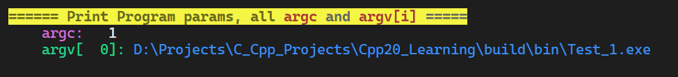
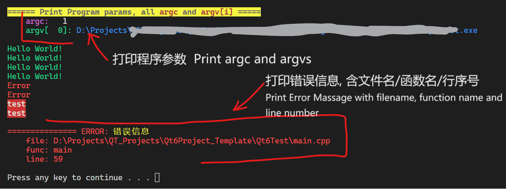
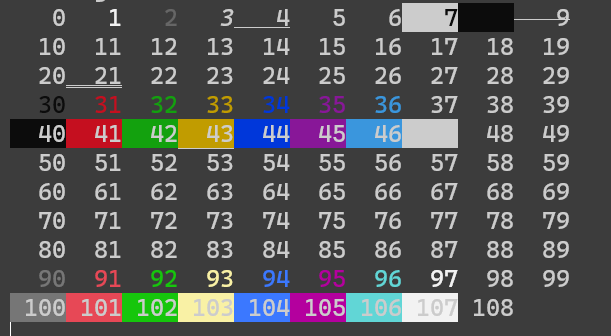

# ConsoleUtil

A **HEADER FILE** project with macros that can change text color/style and move cursor in CONSOLE by ANSI Escape Codes, and some utility macros for CUDA and Qt

WARNING: for Windows system, **Only Windows 10/11 is supported**. These macros cannot work properly in Windows 8/7/vista/xp or prior versions.

一个可以对 C\C++ 命令行 更改颜色/移动光标 的**头文件**项目, 利用 ANSI Escape 控制字符, 且含一些常见懒人包


WARNING:

- features using Ansi Escape code (like color customizing, or cursor moving macros in this header file) **DO NOT SUPPORT Windows version lower than Windows 10**.
    - If you are using these operating systems, pls `#define CONSOLE_UTIL_ANSI_UTIL_UNSUPPORTED  1` before `#include <ConsoleUtil.h>` to disable features by printing Ansi Escape Code.

- Pls **#include other headers previously**, especially headers of Qt/fmtlib.

警告：

- 一些利用 Ansi 控制字符的功能（如颜色自定义、光标移动等）无法在 Windows 10 以下版本的 Windows 中使用。
    - 如果正在使用这些操作系统，请加入宏定义  `#define CONSOLE_UTIL_ANSI_UTIL_UNSUPPORTED  1` before `#include <ConsoleUtil.h>` 以禁用这些通过打印 Ansi 控制字符来实现的功能。

- 若源文件使用了 fmtlib 或 Qt 等库, 请先 #include 这些头文件，最后 #include 此头文件。


---

### Major Features 主要功能:

1. **Set Front Color, Back Color, and font style** for messages to print by printf/cout.

   向命令行 printf/cout 时 **设置输出文本的 颜色、背景颜色、特殊效果** （借助 ANSI 转义序列 命令行控制字符 `\033[**m`）

   Example:

   ```c++
   printf(BRed FLGreen CQFlash, "test" CReset "\n"); // Red Background, Light Green Text Forecolor, and flashing quickly
   std::cout << CCyan "test" CReset << "\n"; // Text forecolor: cyan
   fmt::println(CYellow "test" CReset);      // Text forecolor: yellow
   ```

   

2. **Control text cursor location** in console, or erase text.

    控制命令行光标，部分擦除命令行内容（借助 ANSI 转义序列 命令行控制字符 `\033[**m`）

    Example:

    ```c++
    printf(CForward(2)); // move thr cursor 2 characters right
    printf(CCursorPos(15, 20)); // move the text cursor to (15, 20) position
    CUTIL_CONSOLE_CURSOR_POS(15, 20); // equivalent, calls SetConsoleCursorPosition() in win32.
    
    ```

    

3. **set console encoding**, console **window size** (in windows), or **console title**, also with pause program and force abort the program.

    设置命令行编码、清空命令行、设置命令行窗口大小、标题、暂停程序、强行退出程序（借助 stdlib.h 中的 system() 函数, 部分功能需要 windows 操作系统下才能完成）

    

    Example:

    ```c++
    CUTIL_CHCP_ENCODING_UTF8(); 	// switch console encoding to UTF-8 (windows)
    CUTIL_CONSOLE_TITLE("MyProject"); // set console window title
    CUTIL_CONSOLE_SIZE(100, 30);	// set console window size to with of 30 chars and height of 30 lines (only available in windows)
    CUTIL_CONSOLE_CLEAR();			// clear console (calls system("cls") )
    
    printf("中文한글\n");	// you can correctly display this when the code saved in UTF-8 Encoding, especially in MSVC Compiler.
    
    ```

    ```c++
    // available encodings:
    CUTIL_CHCP_ENCODING_UTF8();
    CUTIL_CHCP_ENCODING_GB2312();
    CUTIL_CHCP_ENCODING_BIG5();
    CUTIL_CHCP_ENCODING_KOR();
    CUTIL_CHCP_ENCODING_JIS();
    CUTIL_CHCP_ENCODING_LATIN1();
    CUTIL_CHCP_ENCODING_LATIN2();
    CUTIL_CHCP_ENCODING_CYR();
    CUTIL_CHCP_ENCODING_WIN1250();
    CUTIL_CHCP_ENCODING_WIN1251();
    CUTIL_CHCP_ENCODING_WIN1252();
    ```

    

    

4. Flush the input buffer to ensure that subsequent "scanf()" or "cin" calls receive valid input.

    吸收输入缓存区内的其余字符, 以便下次 scanf 或 cin 时能够获取到正确的输入内容

    ```c++
    // #define CUTIL_FLUSH_INPUT_BUFFER()	{char ch; while((ch = getchar()) != '\n') continue;}
    int num1, num2;
    scanf("%d", &num1);
    CUTIL_CONSOLE_FLUSH_INPUTBUFFER(); // flush input buffer
    scanf("%d", &num2);
    ```

    

5. 按顺序打印 main 函数的 argc 和 argv 参数

    **print argc and argv arguments** of main(int argc, char* argv[]) function in sequence.

    Example:

    ```c++
    int main(int argc, char* argv[]){
    	CUTIL_PRINT_ARGV(argc, argv);// print all argc and argv[n] of main() function
    	return 0;
    }
    ```

    

    

6. **Print custom Error Message** with filename, line number and function name

    打印错误信息，并输出当前文件名、行号、函数名

    

    

7. Other useful C/C++ Macros

    -  decide if the project is in debug build mode (you should use MSVC, otherwise predefine `IS_DEBUG` macro in project in debug mode.

        ```c++
        #if (defined(_DEBUG) || defined(IS_DEBUG) || defined(DEBUG)) && !(defined(NDEBUG) || defined(_NDEBUG))
        	#define CUTIL_GET_IS_DEBUG_BUILD 	 1
        #else // defined(NDEBUG)
        	#define CUTIL_GET_IS_DEBUG_BUILD 	 0
        #endif
        
        
        ```

        ```c++
        #if CUTIL_GET_IS_DEBUG_BUILD // debug build
        #else // release build
        #endif
        ```

        

    -  set bit to a unsigned integer variable in some hardware projects

        ```c++
        uint16_t num {0b00000000'00000001}; // C++14
        // the 2nd parameter is the index of bit, starts at 0
        CUTIL_BIT_SET(num, 0);		// equals to (num |=  (1u << 0));
        CUTIL_BIT_CLEAR(num, 2);	// equals to (num &= ~(1u << 2));
        CUTIL_BIT_TOGGLE(num, 3);	// equals to (num ^=  (1u << 3));
        
        if(CUTIL_BIT_GET(num, 0) != 0){ // reading bit, if bit is 1, returns (1<<BIT_IDX), NOT 1
        	printf("%x\n", num);
        }
        ```
    
    -  swap variables in C (do not use in C++, pls replace with std::swap())
    
        ```c
        int a = 1, b = 2;
        CUTIL_SWAP_VARS(a, b, int); // declare type in 3rd arg.
        CUTIL_SWAP_VARS(a, b, typeof(int)); // GNU C only
        CUTIL_SWAP_VARS_GNU(a, b); 			// GNU C only
        ```
    
    -  print text only in debug build
    
        ```c++
        int a{1};
        CUTIL_DEBUG_PRINTLN("debug text {}", a); // calls fmt::println or std::println
        CUTIL_DEBUG_COUT("debug text " << a << '\n'); // calls std::cout
        CUTIL_DEBUG_PRINTF("debug text %d", a); // calls printf
        // these macro funcs would DO NOTHING IN RELEASE BUILD.
        ```
    
    -  count amount of arguments (up to 35)
    
        ```c
        int a = CUTIL_VA_CNT(); 			// -> 0
        int b = CUTIL_VA_CNT(b1); 			// -> 1
        int c = CUTIL_VA_CNT(c1, c2); 		// -> 2
        int c = CUTIL_VA_CNT(c1, c2, c3); 	// -> 3
        ```
        
    -  match C++ language version, especially if you want to let the project build both by MSVC and G++.
    
        equals to "`_MSVC_LANG`" in MSVC, and "`__cplusplus`" in other compilers.
    
        ```c++
        #if CUTIL_CPP_VER_HIGHER_EQUAL_THAN(199711) 	// do not add "L" after number
        #if CUTIL_CPP_VER_HIGHER_EQUAL_THAN(201103)	// C++11
        #if CUTIL_CPP_VER_HIGHER_EQUAL_THAN(201402)	// C++14
        #if CUTIL_CPP_VER_HIGHER_EQUAL_THAN(201703)	// C++17
        #if CUTIL_CPP_VER_HIGHER_EQUAL_THAN(202002)	// C++20
        #if CUTIL_CPP_VER_HIGHER_EQUAL_THAN(202302)	// C++23 (temporary not supported)
        ```
    
    -  set C++11 class constructor/moving/copying to disabled/default
        ```c++
        class MyClass{
        public:
            CUTIL_CLASS_DEFAULT_CONSTRUCTOR(MyClass) // generates MyClass(), ~MyClass() = default;
            
            CUTIL_CLASS_DISABLE_COPY_MOVE(MyClass) // cannot move or copy this class
            // =delete: MyClass(const MyClass&), operator=(const MyClass&), MyClass(MyClass&&), operator=(MyClass&&),
        }
        
        class MyClass{
        public:
            CUTIL_CLASS_DEFAULT_FUNCTIONS(MyClass)
            // generates 6 functions =default: MyClass(), ~MyClass(), MyClass(const MyClass&),
            //     operator=(const MyClass&), MyClass(MyClass&&), operator=(MyClass&&)
        }
        /* available macros:
        #define CUTIL_CLASS_DEFAULT_CONSTRUCTOR(_CLASS_NAME)
        #define CUTIL_CLASS_DISABLE_COPY(_CLASS_NAME)
        #define CUTIL_CLASS_DEFAULT_COPY(_CLASS_NAME)
        #define CUTIL_CLASS_DISABLE_MOVE(_CLASS_NAME)
        #define CUTIL_CLASS_DEFAULT_MOVE(_CLASS_NAME)
        #define CUTIL_CLASS_DISABLE_COPY_MOVE(_CLASS_NAME)
        #define CUTIL_CLASS_DEFAULT_COPY_MOVE(_CLASS_NAME)
        #define CUTIL_CLASS_DEFAULT_FUNCTIONS(_CLASS_NAME)
        */
        ```
    
    -  memory allocation and operations for C (wrapped `malloc()` `free()` `memset()` `memcpy()` with typename to macros)
    
        ```c
        const size_t length = 20; // length of numbers
        uint32_t* aD1 = CUTIL_TYPE_MALLOC(uint32_t, length); // std::vector<uint32_t> v1(20); -> elements == 0xCDCDCDCD in heap
        uint32_t* aD2 = CUTIL_TYPE_CALLOC(uint32_t, length); // std::vector<uint32_t> v1(20, 0x00000000);
        uint32_t aD3[length]; // C99 VLA, unsupported in C++, -> elements == 0xCCCCCCCC in stack
        
        uint32_t* aD3 = CUTIL_TYPE_MEMSET(uint32_t, length, 0x66, aD1); // set all elements of aD1 to 0x66666666, returns aD3 == aD1
        uint32_t* aD4 = CUTIL_TYPE_MEMMOVE(uint32_t, length, aD2, aD1); // copy aD1 elements to aD2, returns aD4==aD2
        uint32_t* aD5 = CUTIL_TYPE_MEMCPY(uint32_t, length, aD2, aD1);  // equivalents to above.
        
        int compResult = CUTIL_TYPE_MEMCMP(uint32_t, length, aD1, aD2); // returns 0, contents of mem blocks equal.
        
        CUTIL_TYPE_FREE(aD1); // element values -> 0xDDDDDDDD (deleted heap)
        CUTIL_TYPE_FREE(aD2);
        
        ```
    
        


8. **Some Macros for Qt Projects**:

    - Enable **High DPI Support for Qt5** programs (enable since Qt5.6.0, and fractional scaling since Qt5.14.0). Qt6 supports it by default.

    - Set **Qt5 TextCodec Encoding**, like UTF-8 or GBK to let qDebug() correctly displays Chinese characters with UTF-8 code page and MSVC compiler.

        ```c++
        #include <qglobal.h>
        #include <QApplication>
        #include <QDebug>
        #include <QTextCodec> // include Qt headers first
        
        #include <ConsoleUtil.h> // include this header at last
        
        int main(int argc, char* argv[]){
        	CUTIL_CHCP_ENCODING_UTF8();
        	CUTIL_QT5_TEXTCODEC_UTF8(); // this code saves in UTF-8 encoding
        	
        	CUTIL_QT5_HIGH_DPI(); // enable Qt5 high DPI support
        	
        	QApplication app(argc, argv); // declare QCoreApplication after these macros.
            
        	return app.exec();
        }
        
        /* available encodings:
            CUTIL_QT5_TEXTCODEC_UTF8()
            CUTIL_QT5_TEXTCODEC_GBK()
            CUTIL_QT5_TEXTCODEC_BIG5()
            CUTIL_QT5_TEXTCODEC_EUCKR()
            CUTIL_QT5_TEXTCODEC_EUCJP()
            CUTIL_QT5_TEXTCODEC_JIS()
        */
        ```

        

     

9. CUDA 中，检测部分函数的返回状态，如 != cudaSuccess 则输出错误信息，或强行退出程序

   

Reference of Ansi Escape Codes: https://en.wikipedia.org/wiki/ANSI_escape_code

**ANSI 转义序列 参考**：https://zh.wikipedia.org/wiki/ANSI%E8%BD%AC%E4%B9%89%E5%BA%8F%E5%88%97


----------------

### How To Include in CMake:

1. use `find_package()` in `CMakeLists.txt` in your project to find `ConsoleUtil` CMake package.

    ```cmake
    set(ConsoleUtil_DIR "D:/3rdlibs/ConsoleUtil/cmake") # there's file `ConsoleUtilConfig.cmake`
    find_package(ConsoleUtil REQUIRED)
    ```
    make sure that there's file `ConsoleUtilConfig.cmake` in the folder `cmake`.
2. link `ConsoleUtil` to your target.

   ```cmake
   project(myProject LANGUAGES CXX)
   add_executable( ${PROJECT_NAME} "main.cpp") # create a app target
   
   target_link_libraries( ${PROJECT_NAME}
   	ConsoleUtil # this Library
       # fmt::fmt-header-only # other 3rd libraries
   )
   ```

3. include "`ConsoleUtil.h`" in your source file, and check if there's macro `CONSOLE_UTIL_VERSION` equals to version number. Pls make sure that this header is included after the std/Qt and win32/Linux headers.

    

---

### Example 使用样例:

```cpp
#include <print.h>			// C++23
#include <windows.h>		// include other headers first
#include <fmt/core.h>		// include other headers first
	
#include <ConsoleUtil.h> 	// include this header at last
	
int main(int argc, char* argv[]){
	CUTIL_CHCP_ENCODING_UTF8(); 	// switch console encoding to UTF-8 (windows)
	CUTIL_CONSOLE_TITLE("MyProject"); // set console window title
	CUTIL_CONSOLE_SIZE(100, 30);		// set console window size to with of 30 chars and height of 30 lines.
	CUTIL_CONSOLE_CLEAR();			// clear console (system("cls"))
	
	CUTIL_PRINT_ARGV(argc, argv);	// print all argc and argv[n] of main() function
	
	printf(FLGreen "Hello World!\n" CReset);   // print "Hello World" with light yellow console color formatting
													you should put "CReset" at the end of string to RESET console font color to DEFAULT
	printf(CStyle(FLGreen, "Hello World!\n")); // Equivalent
	
	std::cout << FLRed "ERROR\n" CReset;  // print "ERROR" with font color light red, "CReset" is also needed to revert font color to default
	std::cout << CStyle(FLRed, "ERROR\n");// Equivalent
	
	printf(BRed FGreen CQFlash "test\n" CReset);  // Print text with green font and red background, and quickly flashing
	printf(CStyle(BRed FGreen CQFlash, "test\n"));// Equivalent
	
	
	printf(CForward(2)); // move thr cursor 2 characters right
	
	
	CUTIL_PRINT_ERR("error occurred!"); // print an error message with filename, function name and line number ATTACHED.
	
	CUTIL_CONSOLE_PAUSE(); 			 // system("pause");
	
	return 0;
}
```


**Console Effects 控制台效果** :




